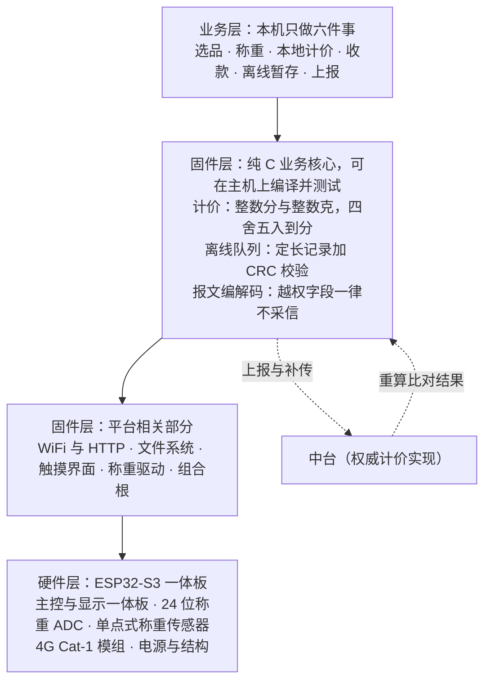
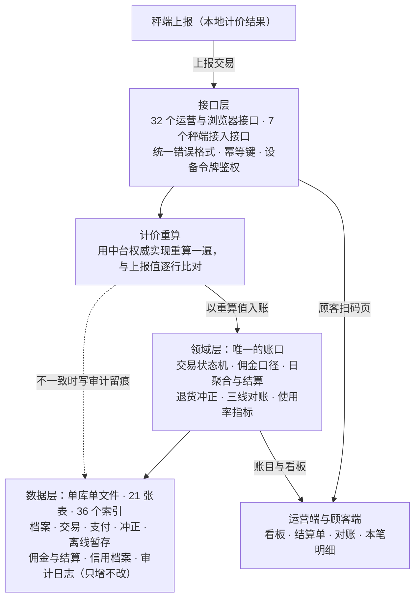

# 总体方案

> 一句话：**把交易锚在秤上，把账口收到中台，把摊主的操作减到最少。**
> 判据是**数据可信度优先于功能数量** —— 功能少一个可以补，账错一笔没有第二次机会。

## 一、问题梳理关键点

1. 抽佣这条路已有三例可核对的失败：成都温江（2‰，最后全额退还）、赣州龙南（商户搬离市场）、南宁 7 个市场（POS 全线停用）。
2. 唯一活了二十多年的温州模式，收的是**买方**的钱（0.5%–6%），同时不再收摊位租金。
3. 商户拒绝的真正原因不是钱，是**用了溯源秤就不能再搞"八两秤"**。
4. 只"免费送设备"不够，**维修不及时是设备落灰的第一原因** —— 必须是"免费 + 统一检定 + 免维护"。
5. 让商户自费买秤（3750 / 4600 元一台）基本等于注定被弃用。
6. 钱其实不来自商户：郑州形成 1.4 亿元流水、达川由银行出三年 200 余万元、建行大连、上海宝山按投入 50% 补贴。
7. 一条不能碰的线：**资金不能先进市场方账户再自行结算**（无牌照即违法）。
8. 装了的设备没人用 —— 验收看**装机量**、不看**使用率**，设备黑屏也能通过验收。
9. 顾客现在基本不扫码，因为扫出来是空壳："扫过好几次空码之后，再也不信这个标签了。"
10. 硬件有真实中标价 1350–4425 元一台；摊位小屏 1100 元一台；**网络改造比秤还贵**（中山 120.5 万元，占标的三分之一）。
11. 设备年故障率、维修单价、罚款、顾客扫码率基线等参数**没有公开数据** —— 只能给方向，不能给数值。
12. 目标规模与演示规模差一个量级：**容量按单市场约 300 摊位设计，这一期只跑 1 个市场、10 个摊位**。

> 这 12 条的展开、案例原话与来源链接见 [问题梳理](01-问题梳理.md)。

## 二、解决方案

### 2.1 方案说明

一套**单机可跑、也能拆成"秤端 × N ↔ 中台 × 1"**的菜市场交易与佣金系统：摊主在摊位上用智能秤完成**选品 → 称重 → 计价 → 收款**，交易经秤端上报中台，中台用权威实现**重算一遍再入账**，运营方据此结算佣金、看经营数据。

主干链路（八个环节，一环都不省）：

```
商户 → 商品 → 称重 → 计价 → 交易 → 支付 → 佣金 → 经营数据查看
```

四条核心设计：

| # | 设计 | 一句话 |
|---|---|---|
| 1 | **秤是唯一的物理锚点** | 系统不接受手工输入重量和金额；界面上没有"随便输金额"的入口，改价必须留痕 |
| 2 | **账口唯一** | 佣金 / 日聚合 / 结算单 / 看板 / 退货冲正一律在中台；秤端只做本地计价与上报 |
| 3 | **离线绝不静默丢弃** | 断网继续收钱、本地持久暂存、恢复后按幂等键补传、补传成功后清除本地副本 |
| 4 | **佣金口径可配置，但不向商户抽** | 引擎照做（收费对象 / 费率 / 品种档位可配），按**实收金额**算；方案论证说明这笔钱不该由商户出 |

两个交付形态，同一套能力：

| 形态 | 怎么跑 | 用途 |
|---|---|---|
| **单机版** | 一个进程里含秤端页面、运营端、顾客页和全部账务 | 现场演示主路径；**无 WiFi 时的降级方案** |
| **分离版** | 秤端 × N ↔ 中台 × 1，走真实 HTTP | 对应"100 个商家 = 100 台秤 + 1 个中台"的目标形态 |

### 2.2 总体架构


**数据怎么流**：交易数据从秤端**单向**流入中台；中台重算后入账，再分发给运营端与顾客端。**中台不反向改秤端数据**，运营端与顾客端**只能读**。

**一条最重要的链**：秤端上报 → 中台重算 → 逐行比对 → **以中台重算值入账**。一致就正常入账；不一致则入账取重算值、写审计留痕、并在响应里如实返回差异 —— 三件事一件都不能省。

### 2.3 智能秤架构



**三层各管什么**：

| 层 | 管什么 | 关键点 |
|---|---|---|
| 业务层 | 摊主看到和点到的 | 只做六件事；**禁止打字**，大图标/快捷键选品，交互不超过 3 次 |
| 固件层（核心） | 计价、离线队列、报文编解码 | **纯 C、不依赖 ESP-IDF**，所以能在主机上编译并跑测试；这是"两份实现逐位一致"的可验证前提 |
| 固件层（平台） | WiFi / HTTP / 文件系统 / 触摸 / 称重驱动 | 只在真机上有意义，**目前未验证** |
| 硬件层 | ESP32-S3 一体板 | 见第三节 |

**本地计价为什么要做两份**：秤端要在断网时也能算钱，所以本地必须有计价实现；但**账口只能有一个**，所以要三条对冲防它和中台走样 ——
① 核心写成不依赖 ESP-IDF 的纯 C，能上主机测试；
② 从权威实现导出**黄金向量**做逐位比对；
③ 中台收到上报后**再独立重算一遍**。
**缺任何一条，"逐位一致"就只是一句口头承诺。**

**离线暂存**：定长记录 + 校验和，追加写；达阈值只**告警**、仍继续接受交易；写入失败**明确报错且不得记为成功**；补传成功后**清除本地副本**（载荷置空并记下清除时间）。

### 2.4 中台架构



**三点说明**：

| 点 | 内容 |
|---|---|
| **唯一账口** | 佣金、日聚合、结算、看板、退货冲正全部在领域层算；**同一件事只有一份实现**，不存在第二份佣金口径 |
| **重算入账** | 收到上报后先重算，**入账金额取中台重算值**。不一致不做成错误码 —— 那会逼出坏选择：拒收（摊主已经收了顾客的钱）或让秤端改金额（账口从一个变成三个） |
| **仍然是单体** | 分离版加了"秤端"这一层边缘，但中台内部仍是**一个代码库、一个进程、一个数据库**。微服务的几条触发条件（多团队、发布节奏差、服务治理能力等）逐条对照**一条都不满足** |

**数据层的三条纪律**：① 金额整数"分"、重量整数"克"，不用浮点；② **同一个事实不存两遍**（不建改价记录表、不建对账结果表、不建指标表，全部现场算）；③ 审计日志由数据库触发器保证**只增不改**。

## 三、硬件

### 3.1 智能秤硬件设计

**部件构成**（推荐配，路线 B）：

| 部件 | 型号 | 关键规格 | 单价 |
|---|---|---|---|
| 主控 + 显示一体板 | 微雪 ESP32-S3 Touch LCD 4.3 一体板 | ESP32-S3-WROOM-1-N16R8；4.3″ 800×480 电容触摸；板载 WiFi/BLE | ¥188.52 |
| 称重 ADC | ADS1232IPWR | 24 位 ΔΣ；内置 PGA；最高 80 SPS | ¥10.2243 |
| 称重传感器 | 单点式铝合金 | 单点式；量程 3–50 kg；精度等级 C3 | ¥66.00 |
| 4G 模组 | A7670E Cat-1 | LTE Cat-1；下行 10 Mbps / 上行 5 Mbps | ¥192.83 |
| 电源 + 结构 + 线束 | 5V/2A 适配器、ABS 外壳、连接器 | 面板开孔与 4.3″ 屏匹配 | ¥46.6457 |
| **合计** | | | **¥504.22** |

**三档配置**：

| 档位 | 主控+显示 | 称重 ADC | 传感器 | 4G | 杂项 | 合计 |
|---|---|---|---|---|---|---|
| 最低配 | ¥188.52 | HX711 ¥1.72 | ¥66.00 | 不含（仅 WiFi） | ¥54.08 | **¥310.32** |
| **推荐配** | ¥188.52 | ADS1232 ¥10.2243 | ¥66.00 | Cat-1 ¥192.83 | ¥46.6457 | **¥504.22** |
| 高配 | ¥222.19 | ADS1232 ¥14.41 | ¥99.68 | Cat-4 ¥742.81 | ¥34.65 | **¥1113.74** |

**关键结论**：成本差异**不在传感器上** —— 称重链路在两条技术路线里几乎一样；省下来的是"主控和屏做成一体板"以及 MCU 的单价量级。换成嵌入式 Linux 单板（路线 A），推荐配要 ¥800.32，**贵约 37%**。

> **这三个数要这样读：¥310.32 / ¥504.22 / ¥1113.74 都是「上界估计」，不是报价，也不能当采购预算。**
> 其中含**没有公开来源、由总额反算配平**的杂项工程估算。推荐配里**有公开来源的部分是 ¥457.57**。要拿去询价，请用 ¥457.57 起谈。

**现场防护方向**（只给方向，不给数值）：目标 IP65、目标 ≥800 nit 强光可读、耐油污可擦拭触摸、宽温工业级元件、称重采样要**数字滤波 + 稳定判据**（读数稳定了才允许计价，不是瞬时值即用）、断电断网下离线队列不丢。

**合规要先于选型**：贸易结算用秤需要**型式批准**（国际建议 OIML R76-1）与**强制检定**（规程归 JJG 539）；防护等级试验方法依据 GB/T 4208-2017。**我们不构成合规结论** —— 能不能生产、销售、投用，要由合规判定给出。

### 3.2 为什么走"自己设计、自己开发"这条路

**理由一：市售整机给不了"本地计价与中台逐位一致"的保证。** 这是最核心的一条 —— **佣金口径必须唯一，否则 100 台秤会算出 100 套账**。市售整机的计价逻辑在厂商手里，我们既改不了、也验不了；而自研可以把核心写成纯 C，用黄金向量逐位钉住。

**理由二：离线暂存"绝不静默丢弃"这条要求，现成整机给不了保证。** 断网期间的暂存、幂等补传、补传成功后清除本地副本，是一套必须**在中台侧能对得上**的协议；整机只保证"自己存了"，保证不了"和对端账目一致"。

**理由三：成本。** 见 3.3 —— 相对市售智能溯源秤，自研便宜得多。

**同时要如实说清一条**：相对**低端计价秤整机**（FOB 约 ¥55–141，只能称重收钱），自研**更贵**。

| 对照 | 单价 | 说明 |
|---|---|---|
| 低端计价秤整机 | 约 ¥55–141 | 只能称重收钱，**没有**可核验的数据链路 |
| 自研秤端（推荐配） | 约 ¥504.22（上界估计） | 本地计价与中台逐位一致 + 离线不丢 + 上报可重算 |

**这个差价买的是"可核验的交易数据链路"，不是屏幕或外壳。** 如果目标降级成"只要能称重收钱"，那这份成本论证就不适用了 —— 直接采购整机更划算。

### 3.3 这套方案能省多少钱

**对照物：市售智能溯源秤的真实中标价**（每个价格点对应一个独立项目，可点开招标公告核对）：

| 对照物 | 单价 | 来源（招标公告） |
|---|---|---|
| 普通溯源秤 | **1350 元/台** | [沙溪镇农贸市场智慧提升](https://ggzy.suzhou.gov.cn/jyxx/003013/003013002/20241223/6ea6fe5e-8f6d-44df-929f-4bd59893f2e7.html) |
| 普通溯源秤 | **2145 元/台** | [双凤镇农贸市场改造](https://www.szzyjy.com.cn/jyxx/003013/003013002/20250103/b8ed9b2e-773f-40ce-8257-31547155bcfe.html) |
| 普通溯源秤 | **2566 元/台** | [淼泉集贸市场](https://ggzy.suzhou.gov.cn/jyxx/003024/003024006/003024006003/20251020/c7bb93de-0b3b-49fb-b48e-4d21b81afb7d.html) |
| 彩屏溯源秤 | **1400 元/台** | [迎江区辉煌路菜市场](https://wanyi.etrading.cn/jyxx/002002/002002005/20251219/bb848fe8-def4-4c84-beda-d853e9398531.html) |
| AI 智慧溯源秤 | **3350 元/套** | [板桥农贸市场](https://ggzy.suzhou.gov.cn/jyxx/003032/003032002/003032002002/20241126/04980e34-dc87-4d87-90b0-791b4713ee8f.html) |
| 触屏 AI 收银一体秤 | **4425 元/台** | [双凤镇农贸市场改造](https://www.szzyjy.com.cn/jyxx/003013/003013002/20250103/b8ed9b2e-773f-40ce-8257-31547155bcfe.html) |

**自研对照**：路线 B（ESP32-S3）推荐配 **约 ¥504.22/台（上界估计）**，其中有公开来源的部分 **¥457.57**。

**节省表**（自研按 ¥504.22 计）：

| 对照 | 市售单价 | 自研 | 每台省 | 省幅 | 300 摊位合计省 |
|---|---|---|---|---|---|
| 非 AI 溯源秤（低） | 1350 | 504.22 | **845.78** | **62.7%** | **25.4 万元** |
| 非 AI 溯源秤（高） | 2566 | 504.22 | **2061.78** | **80.3%** | **61.9 万元** |
| 触屏 AI 收银一体秤 | 4425 | 504.22 | 3920.78 | 88.6% | 117.6 万元 |

**两个规模口径**：

| 口径 | 市售 | 自研 | 差额 |
|---|---|---|---|
| **目标规模**：单市场 300 摊位（沿用调研假设：1 市场 300 摊、每摊 1 台秤） | 40.5 万 – 77 万元（非 AI 档） | 约 15.1 万元 | 省 25.4 万 – 61.9 万元 |
| **演示规模**：单市场 10 摊位 | 1.35 万 – 2.57 万元 | 约 0.50 万元 | 省 0.85 万 – 2.06 万元 |

**⚠️ 三条必须一起读的口径**：

1. **¥504.22 是"上界估计"，不是报价、不是采购预算。** 它含没有公开来源、由总额反算配平的杂项工程估算；有公开来源的部分是 **¥457.57**。对外引用请写"约 ¥504/台（上界估计）"。
2. **表右边的价格和左边的价格不是同一种数字。** 右边是**已经成交的真实整机中标价**（含厂商毛利、包装、认证、质保、税与售后），左边是我们的**物料成本估算**。**两者不能相减当成"利润"讲** —— 这是"物料估算 vs 整机中标价"的对比，不是利润测算。而且量产 4.3″ 裸屏**没有公开来源**，我们用开发板一体板代理，量产实际物料成本可能高于这份小计。
3. **论点顺序不能倒。** 我们不是"因为便宜所以选自研"，而是：① 先要**可核验的交易数据链路**（市售整机给不了，见 3.2 理由一、二）；② 在这个前提下，自研**还更省钱**。**便宜是结果，不是理由。**

**另外两项容易被漏算的开支**（都能改变总账）：摊位小屏 **1100 元/台**（目标只是"价格看得见"时，物理价签便宜一个量级）；**网络改造比秤还贵** —— 中山一个项目 WiFi 布线 88 万元 + 专线 32.5 万元，占 366.9 万元标的三分之一。**这两项必须实测，不能套用。**

---

**配合阅读**：[问题梳理](01-问题梳理.md)（问题、案例原话、关键假设、我们还没做到的事）·
[附录 A：智能秤](03-附录A-智能秤设计.md)（选型理由、协议、离线设计、验证到哪一步）·
[附录 B：中台](04-附录B-中台设计.md)（数据模型、接口、佣金、幂等对账、可靠性）。
