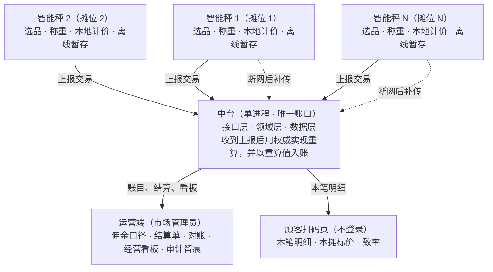
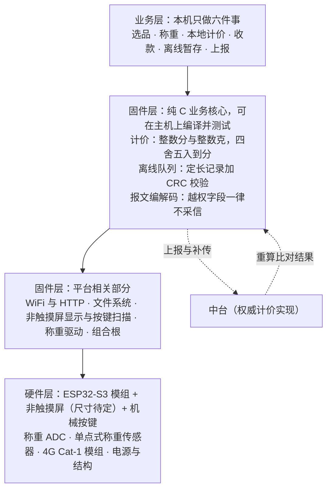
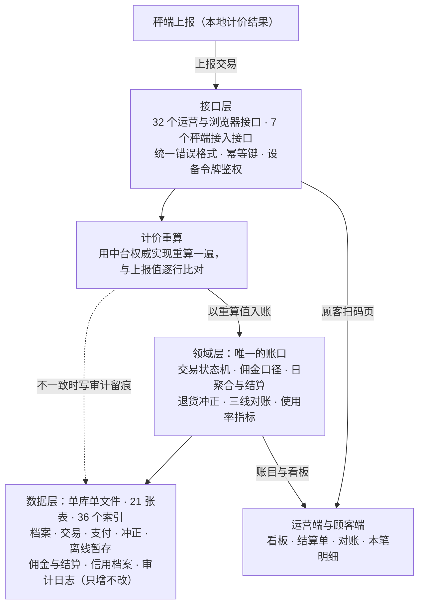

# 总体方案

> 一句话：**把交易锚在秤上，把账口收到中台，把摊主的操作减到最少。**
> 判据是**数据可信度优先于功能数量** —— 功能少一个可以补，账错一笔没有第二次机会。

## 一、问题梳理关键点

1. 抽佣这条路已有三例可核对的失败：成都温江（2‰，最后全额退还）、赣州龙南（商户搬离市场）、南宁 7 个市场（POS 全线停用）。
2. 唯一活了二十多年的温州模式，收的是**买方**的钱（0.5%–6%），同时不再收摊位租金。
3. 商户拒绝的真正原因不是钱，是**用了溯源秤就不能再搞"八两秤"**。
4. 只"免费送设备"不够，**维修不及时是设备落灰的第一原因** —— 必须是"免费 + 统一检定 + 免维护"。
5. 让商户自费买秤（3750 / 4600 元一台）基本等于注定被弃用。
6. 钱其实不来自商户：郑州形成 1.4 亿元流水、达川由银行出三年 200 余万元、建行大连、上海宝山按投入 50% 补贴。
7. 一条不能碰的线：**资金不能先进市场方账户再自行结算**（无牌照即违法）。
8. 装了的设备没人用 —— 验收看**装机量**、不看**使用率**，设备黑屏也能通过验收。
9. 顾客现在基本不扫码，因为扫出来是空壳："扫过好几次空码之后，再也不信这个标签了。"
10. 硬件有真实中标价 1350–4425 元一台；摊位小屏 1100 元一台；**网络改造比秤还贵**（中山 120.5 万元，占标的三分之一）。
11. 设备年故障率、维修单价、罚款、顾客扫码率基线等参数**没有公开数据** —— 只能给方向，不能给数值。
12. 目标规模与演示规模差一个量级：**容量按单市场约 300 摊位设计，这一期只跑 1 个市场、10 个摊位**。

> 这 12 条的展开、案例原话与来源链接见 [问题梳理](01-问题梳理.md)。

## 二、解决方案

### 2.1 方案说明

一套**单机可跑、也能拆成"秤端 × N ↔ 中台 × 1"**的菜市场交易与佣金系统：摊主在摊位上用智能秤完成**选品 → 称重 → 计价 → 收款**，交易经秤端上报中台，中台用权威实现**重算一遍再入账**，运营方据此结算佣金、看经营数据。

**主干链路（八个环节，一环都不省）**：商户 → 商品 → 称重 → 计价 → 交易 → 支付 → 佣金 → 经营数据查看。

| # | 设计 | 一句话 |
|---|---|---|
| 1 | **秤是唯一的物理锚点** | 系统不接受手工输入重量和金额；界面上没有"随便输金额"的入口，改价必须留痕 |
| 2 | **账口唯一** | 佣金 / 日聚合 / 结算单 / 看板 / 退货冲正一律在中台；秤端只做本地计价与上报 |
| 3 | **离线绝不静默丢弃** | 断网继续收钱、本地持久暂存、恢复后按幂等键补传、补传成功后清除本地副本 |
| 4 | **佣金口径可配置，但不向商户抽** | 引擎照做（收费对象 / 费率 / 品种档位可配），按**实收金额**算；方案论证说明这笔钱不该由商户出 |

| 形态 | 怎么跑 | 用途 |
|---|---|---|
| **单机版** | 一个进程里含秤端页面、运营端、顾客页和全部账务 | 现场演示主路径；**无 WiFi 时的降级方案** |
| **分离版** | 秤端 × N ↔ 中台 × 1，走真实 HTTP | 对应"100 个商家 = 100 台秤 + 1 个中台"的目标形态 |

### 2.2 总体架构



**数据怎么流**：交易数据从秤端**单向**流入中台；中台重算后入账，再分发给运营端与顾客端。**中台不反向改秤端数据**，运营端与顾客端**只能读**。

**一条最重要的链**：秤端上报 → 中台重算 → 逐行比对 → **以中台重算值入账**。一致就正常入账；不一致则入账取重算值、写审计留痕、并在响应里如实返回差异 —— 三件事一件都不能省。

### 2.3 智能秤架构



| 层 | 管什么 | 关键点 |
|---|---|---|
| 业务层 | 摊主看到和点到的 | 只做六件事；**禁止打字**，**物理快捷键 + 大图标**选品，交互不超过 3 次 |
| 固件层（核心） | 计价、离线队列、报文编解码 | **纯 C、不依赖 ESP-IDF**，所以能在主机上编译并跑测试；这是"两份实现逐位一致"的可验证前提 |
| 固件层（平台） | WiFi / HTTP / 文件系统 / **非触摸屏显示与按键扫描** / 称重驱动 | 只在真机上有意义，**目前未验证** |
| 硬件层 | ESP32-S3 模组 + **非触摸屏（尺寸待定）** + **机械按键** + **三路传感器路由（含多路开关）** | 见第三节 |

**本地计价为什么要做两份**：秤端要在断网时也能算钱，所以本地必须有计价实现；但**账口只能有一个**，所以要用三条对冲防它和中台走样 —— ① 核心写成不依赖 ESP-IDF 的纯 C，能上主机测试；② 从权威实现导出**黄金向量**做逐位比对；③ 中台收到上报后**再独立重算一遍**。**缺任何一条，"逐位一致"就只是一句口头承诺。**

**离线暂存**：定长记录 + 校验和，追加写；达阈值只**告警**、仍继续接受交易；写入失败**明确报错且不得记为成功**；补传成功后**清除本地副本**（载荷置空并记下清除时间）。

### 2.4 中台架构



| 点 | 内容 |
|---|---|
| **唯一账口** | 佣金、日聚合、结算、看板、退货冲正全部在领域层算；**同一件事只有一份实现**，不存在第二份佣金口径 |
| **重算入账** | 收到上报后先重算，**入账金额取中台重算值**。不一致不做成错误码 —— 那会逼出坏选择：拒收（摊主已经收了顾客的钱）或让秤端改金额（账口从一个变成三个） |
| **仍然是单体** | 分离版加了"秤端"这一层边缘，但中台内部仍是**一个代码库、一个进程、一个数据库**。微服务的几条触发条件（多团队、发布节奏差、服务治理能力等）逐条对照**一条都不满足** |

**数据层的三条纪律**：① 金额整数"分"、重量整数"克"，不用浮点；② **同一个事实不存两遍**（不建改价记录表、不建对账结果表、不建指标表，全部现场算）；③ 审计日志由数据库触发器保证**只增不改**。

### 2.5 收款与结算模型：钱怎么走

**资金链（一条线看完）**：

```
商家注册（商家名 / 手机号 / 收款码）—— 收款码【脱敏后存储】，明文不落库
  → 点【确认】= 本笔视为已完成支付 + 上报中台（携带唯一交易标识，幂等，只生效一次）
  → 点【取消】= 上报中台撤销本笔：账上不计应缴、不计看板（相当于无事发生）；但"取消"这个动作留痕
  → 佣金 = 按佣金口径对【实收金额】逐笔记账
  → 催缴 = 每隔一天向商家手机发短信，告知应缴金额
  → 中台实时显示各商家【应缴多少】
```

**三个演示页**（都走服务端真实能力，不绕过领域层、不引用任何外部资源）：**商家注册页**（录入商家名 / 手机号 / 收款码）· **智能秤页**（选已注册商家 → 预置商品图标、右键放置、按钮上下选品 → 确认出价格与收款码 → 模拟扫码 → 交易成功 → 任意键回初始）· **中台页**（实时表格展示上传 / 取消事件，并显示**各商家应缴金额**）。

**三处口径要说准**：① "取消"**不是"中台把记录删了"** —— **账上等同未发生**，但**这个动作必须留痕**（审计只增不改、绝不静默丢弃）；② "确认即完成支付"是**演示口径**，本期不接真实支付网关，"确认"是**记账事件**、不是资金到账事件；③ "每隔一天发短信"是**催缴机制的设计**，本期演示以**中台页实时显示应缴金额**为准，**短信通道的接入是落地项**（需短信服务商）。

**钱到底怎么走**（这一节请单独看）：

| 问题 | 回答 | 依据 |
|---|---|---|
| 钱先进平台账户吗？ | **不会，也不允许** —— 资金先进平台账户再自行结算，等于**无牌从事支付业务** | 调研原话：**"判定关键不是'扣没扣钱'，而是'资金有没有先进平台账户再自行结算'"**；罚则 **50 万–200 万元**（《非银行支付机构监督管理条例》，国务院令第 768 号） |
| 能"到账同时抽水"吗？ | **做不到，也不该做**：钱直接进商家，我们拦不到；要"同时扣"就必须由**持牌机构分账**（微信支付服务商 / 支付宝 ISV / 银行）—— **是持牌机构在分，不是我们在分** | 分账属持牌业务 |
| 为什么不搞"统一收款码 + 收手续费"？ | **这条路已经失败过两次**：成都温江红桥农贸市场、赣州龙南虔锦智慧市场，都是"强制统一收款码 + 按营业额收手续费"，结果是商户强烈抗议、**大量搬离市场**，龙南最后改成**零手续费** | **这正是本方案选择"只记账 + 账期催缴"的直接原因** |
| 那本期到底怎么收钱？ | **本期不接真实支付网关**：商家用**自己的**收款码收钱，钱**直接进商家的账户**；我们只记录交易、按实收金额算佣金、按账期催缴 | 真实收款需持牌通道 —— 这是**本期范围**的取舍，不是能力上限 |

**对甲方的三句承诺**：① 资金**不经过我们**，无牌经营风险为零；② 佣金**算得清**（逐笔记账、口径唯一）；③ 钱**收得回**（账期催缴 + 应缴金额实时可见）。**至于"钱怎么真正划到市场方手上"，那是接入持牌通道之后的事，本期不假装已经解决。**

## 三、硬件

### 3.1 智能秤硬件设计

**部件与三档配置**（三档均为「机械按键 + 非触摸屏 + 三路传感器路由」口径）：

| 部件 | 型号 / 关键规格 | 最低配 | **推荐配** | 高配 |
|---|---|---|---|---|
| 主控板 | ESP32-S3-WROOM-1-N16R8（带焊针）；16 MB Flash / 8 MB PSRAM | ¥26.80（我方询价） | **¥26.80** | ¥72.19（**未询价**） |
| 显示 + **机械按键** | **非触摸屏（尺寸待定）** + 按键板；屏只显示、不接收触摸 | ¥11.72（估算） | **¥11.72** | 含在内 |
| 称重 ADC | ADS1232IPWR；24 位 ΔΣ、内置 PGA、最高 80 SPS、**单通道** | HX711 ¥1.72 | **¥10.2243** | ¥14.41 |
| **传感器路由（三路）** | 2 kg + 20 kg + 200 kg；**0–2 / 0–20 / 0–200 kg**，见下 | ¥42.40（我方询价） | **¥42.40** | ¥42.40 |
| **模拟多路开关** | 三路**分时采样**用 —— ADS1232 是单通道 | ¥2.00（估算） | **¥2.00** | ¥2.00 |
| **4G Cat-1 裸模块** | Cat-1（**不是开发板 / HAT**）；下行 10 / 上行 5 Mbps | **不含**（仅 WiFi） | **¥25.00** | ¥25.00 |
| 电源 + 结构 + 线束 | 5V/2A 适配器、ABS 外壳；**面板要开屏窗 + 按键孔** | ¥54.08 | **¥46.6457** | ¥34.65 |
| **合计** | | **¥138.72** | **¥164.79** | **¥190.65** |

**传感器不再用单只，改成三路量程路由**：

| 路 | 量程 | 选型 | 价 | 覆盖场景 |
|---|---|---|---|---|
| 精细路 | 0–2 kg | 2 kg 传感器 | ¥10.05 | 名贵水产 / 干货 / 配料 |
| 常规路 | 0–20 kg | 20 kg 传感器 | ¥7.85 | 蔬菜 / 水果 / 肉 / 水产（主力） |
| 大宗路 | 0–200 kg | 小 200 kg 传感器 | ¥24.50 | 整筐 / 批发 / 大件 |
| | | **合计** | **¥42.40** | 原来单只 ¥66.00 |

> **先把一句话说准**：**传感器的量程是硬件属性，程序换不了物理传感器。** 真实机制是两件事 —— ① **选型期**按摊位主营品类决定**装哪几路**（采购决策）；② **运行时**几路**共用一块承重台**，程序**按当前载荷自动选读数**（小载荷走精细路，超阈值切常规路，再超切大宗路），**商家不需要任何切换动作**。
> **"商家不用切换"这个诉求成立**，但说法要落在标准术语上：**这属于「多量程 / 多分度值」仪器，OIML R76 与 JJG 539 都认可这个仪器类型** —— 不是我们自造的概念。**多路开关那一行也不是凑数**：ADS1232 是**单通道** ADC，三路传感器**接不进去**，必须分时采样 —— **它是路由方案的必然代价。**
> **⚠️ 传感器的精度等级必须打问号（这条最要紧）**：上面三个价是**按量程抓到的零售报价，不是按合规型号定的价**。贸易结算用秤的传感器必须满足 **C3 级**、并配合**强制检定**（JJG 539）。**实际选型必须按满足 C3 与检定的型号确认，价格可能高于表中档位。** 我们**不把这些价当成"能过检定的传感器价格"**。

**这一改的收益与代价**：**收益** = 一台秤覆盖 **2 / 20 / 200 kg** 三个量程，**菜摊、肉摊、水产摊、大宗批发用同一种机型**，采购与维护只备一种；**代价** = ① 三只传感器 + 多路开关 = **¥44.40**，**比原来单只 ¥66.00 还便宜 ¥21.60**（如实说）；② 承重台机械设计要能让**三路都受力**；③ **标定要逐路做**。

> **⚠️ 上面两行曾经都算错了，是同一个错误 —— 把"开发板 / 扩展板价"当成了"量产物料价"。** **显示**原来用微雪 **一体板 ¥188.52**（**开发板**，含调试电路、排针、单件包装与零售加价）→ 正确口径 **主控板 ¥26.80 + 屏与按键 ¥11.72**；**4G** 原来用 **A7670E Cat-1 HAT ¥192.83**（**给树莓派用的扩展板**）→ 正确口径 **Cat-1 裸模块 ¥25.00**。
> **我们是自己设计整板，正确基准就应该是裸模块 —— 不是开发板，也不是 HAT。** 这两处加上传感器路由，让推荐配从最初的 ¥504.22 降到 **¥164.79（共降 ¥339.43）**。

**三档配置**（均为「机械按键 + 非触摸屏 + 三路传感器路由」口径）：

| 档位 | 主控板 | 显示+按键 | 称重 ADC | 传感器路由 | 多路开关 | 4G | 杂项 | 合计 |
|---|---|---|---|---|---|---|---|---|
| 最低配 | ¥26.80 | ¥11.72 | HX711 ¥1.72 | ¥42.40 | ¥2.00 | **不含**（仅 WiFi） | ¥54.08 | **¥138.72** |
| **推荐配** | ¥26.80 | ¥11.72 | ADS1232 ¥10.2243 | ¥42.40 | ¥2.00 | **Cat-1 ¥25.00** | ¥46.6457 | **¥164.79** |
| 高配 | ¥72.19（**未询价**） | 含在内 | ADS1232 ¥14.41 | ¥42.40 | ¥2.00 | **Cat-1 ¥25.00** | ¥34.65 | **¥190.65** |

> **高配这一档把 Cat-4 整行去掉了，换成 Cat-1。** 理由不是"Cat-4 不存在" —— **LTE Cat-4 是真实存在的标准类别**，原来那款 SIM7600G-H 就是 Cat-4、也有公开报价。**真正的理由是：我们用不上。** 秤端上传的是**小额交易记录**，Cat-1（下行 10 Mbps / 上行 5 Mbps）绰绰有余，**没有任何一条需求需要 Cat-4 的带宽**。**这就是"按需求选型、不为用不上的规格付钱"** —— 和 3.2 的论点同一条逻辑。

**关键结论**：省下来的是"屏不要触摸功能 + 按键替代触摸 + 4G 用裸模块 + 传感器走三路路由"以及 MCU 的单价量级 —— 换成嵌入式 Linux 单板（路线 A，触摸屏口径 ¥800.32），推荐配**不到它的四分之一**。

> **这三个数要这样读：¥138.72 / ¥164.79 / ¥190.65 都是「接近量产的物料估算」，不是报价，也不能当采购预算。** 按来源分三档（推荐配）：**公开 ¥10.22（6.2%）· 我方询价 ¥94.20（57.2%）· 估算 ¥60.37（36.6%）**，校验 10.22 + 94.20 + 60.37 = **164.79**。
> **⚠️ 公开可点开的占比只剩 6.2%**（改前 90.7%，只有 ADC 一项还能点开核对）—— 原因与"还差哪三块询价"见 §3.3 口径 1；**成本更真实了，但"第三方能点开核对"的部分几乎没有了，这一点我们不掩盖。**

**现场防护方向**（只给方向，不给数值）：目标 IP65、目标 ≥800 nit 强光可读、宽温工业级元件、称重采样要**数字滤波 + 稳定判据**（读数稳定了才允许计价，不是瞬时值即用）、断电断网下离线队列不丢。**操作面从"触摸"改成"机械按键"之后，"耐油污可擦拭触摸"和"可戴手套操作的工业触摸面板"这两个原本没有公开数据的缺口直接消失了** —— 戴着手套、手上有水有油都能按，强光下也不受影响。

**合规要先于选型**：贸易结算用秤需要**型式批准**（国际建议 OIML R76-1）与**强制检定**（规程归 JJG 539）；防护等级试验方法依据 GB/T 4208-2017。**我们不构成合规结论** —— 能不能生产、销售、投用要由合规判定给出。

### 3.2 为什么走"自己设计、自己开发"这条路

**理由一：市售整机给不了"本地计价与中台逐位一致"的保证。** 这是最核心的一条 —— **佣金口径必须唯一，否则 100 台秤会算出 100 套账**。市售整机的计价逻辑在厂商手里，我们既改不了、也验不了；而自研可以把核心写成纯 C，用黄金向量逐位钉住。

**理由二：离线暂存"绝不静默丢弃"这条要求，现成整机给不了保证。** 断网期间的暂存、幂等补传、补传成功后清除本地副本，是一套必须**在中台侧能对得上**的协议；整机只保证"自己存了"，保证不了"和对端账目一致"。

**理由三：自研才能用「机械按键 + 非触摸屏」，而这正是这套交互一直想要的形态。** 摊位现场是潮湿、油烟、粉尘，摊主**戴着手套、手上有水有油**。触摸屏在这三种条件下都不可靠，而"耐油污可擦拭触摸"和"可戴手套操作的工业触摸面板"**两项目前都找不到公开数据** —— 也就是说，走触摸路线，我们连"规格该定到哪"都说不清。机械按键没有这个问题：**戴着能按、有水能按、强光下不受影响。** 它也不是为了省钱临时改的 —— 交互设计从一开始就写着"**禁止打字、大图标/快捷键选品、交互不超过 3 次**"，**物理快捷键正是这条设计的自然落地**。所以这一条**排在成本前面**：先用按键把可靠性拿回来，省钱是顺带的结果。

**这条路线也有代价，一起写清楚**：

| 代价 | 说明 |
|---|---|
| 结构与开孔 | 面板要开屏窗和按键孔，并增加按键结构件。这部分成本**已含在"屏与按键 ¥11.72"这个估算里**，但**同样没有公开报价** |
| **屏幕尺寸要重新选型** | 留给屏与按键的估算只有 ¥11.72，说明配的**不是 4.3 吋 800×480 那种面板**；但屏幕仍要显示**商品清单、金额，以及一个顾客能扫出来的二维码**。**"小尺寸屏 + 可扫描二维码"这两条约束能不能同时满足，必须先做屏幕选型、再上真机验证**；**如果最终必须改用 4.3 吋级面板，这一行的估算要上调，单台合计（¥164.79）也会跟着变** |
| 选品不如触摸直观 | **商品数量多时，翻页/选品没有触摸来得直接** —— 所以商品清单要按"快捷键 + 分页"组织，**不能沿用触摸版的信息密度** |

**理由四：成本。** 见 3.3 —— 相对市售智能溯源秤，自研便宜得多。而且**成本能降下来，靠的不是砍规格，是先把口径改对**（3.1 里那两行开发板 / HAT 价）**和按需求选型**（高配不为用不上的 Cat-4 付钱）。

**同时要如实说清一条**：相对**低端计价秤整机**（FOB 约 ¥55–141，只能称重收钱），自研**更贵**。

| 对照 | 单价 | 说明 |
|---|---|---|
| 低端计价秤整机 | 约 ¥55–141 | 只能称重收钱，**没有**可核验的数据链路 |
| 自研秤端（推荐配：机械按键 + 非触摸屏 + **三路传感器路由** + Cat-1 裸模块） | 约 ¥164.79（接近量产的物料估算） | 本地计价与中台逐位一致 + 离线不丢 + 上报可重算 |

**但这个差距已经缩小了很多，值得一并说清**：按最早那版 ¥504.22 算，自研是低端整机上界（¥141）的**约 3.6 倍**；现在是 **约 1.17 倍**。**差距缩小是降价的结果，不是我们可以把它藏起来的理由** —— 它**仍然更贵**。

**这个差价买的是"可核验的交易数据链路"，不是屏幕或外壳** —— 如果目标降级成"只要能称重收钱"，这份成本论证就不适用了，直接采购整机更划算。

### 3.3 这套方案能省多少钱

**对照物：市售智能溯源秤的真实中标价**（每个价格点对应一个独立项目，可点开招标公告核对）：

| 对照物 | 单价 | 来源（招标公告） |
|---|---|---|
| 普通溯源秤 | **1350 元/台** | [沙溪镇农贸市场智慧提升](https://ggzy.suzhou.gov.cn/jyxx/003013/003013002/20241223/6ea6fe5e-8f6d-44df-929f-4bd59893f2e7.html) |
| 普通溯源秤 | **2145 元/台** | [双凤镇农贸市场改造](https://www.szzyjy.com.cn/jyxx/003013/003013002/20250103/b8ed9b2e-773f-40ce-8257-31547155bcfe.html) |
| 普通溯源秤 | **2566 元/台** | [淼泉集贸市场](https://ggzy.suzhou.gov.cn/jyxx/003024/003024006/003024006003/20251020/c7bb93de-0b3b-49fb-b48e-4d21b81afb7d.html) |
| 彩屏溯源秤 | **1400 元/台** | [迎江区辉煌路菜市场](https://wanyi.etrading.cn/jyxx/002002/002002005/20251219/bb848fe8-def4-4c84-beda-d853e9398531.html) |
| AI 智慧溯源秤 | **3350 元/套** | [板桥农贸市场](https://ggzy.suzhou.gov.cn/jyxx/003032/003032002/003032002002/20241126/04980e34-dc87-4d87-90b0-791b4713ee8f.html) |
| 触屏 AI 收银一体秤 | **4425 元/台** | [双凤镇农贸市场改造](https://www.szzyjy.com.cn/jyxx/003013/003013002/20250103/b8ed9b2e-773f-40ce-8257-31547155bcfe.html) |

**自研对照**：路线 B（ESP32-S3）**机械按键 + 非触摸屏 + 三路传感器路由 + Cat-1 裸模块**口径，推荐配 **约 ¥164.79/台（接近量产的物料估算）**。按来源分三档：**有公开来源 ¥10.22（6.2%）· 我方询价 ¥94.20（57.2%）· 估算 ¥60.37（36.6%）**。

**节省表**（自研按 ¥164.79 计）：

| 对照 | 市售单价 | 自研 | 每台省 | 省幅 | 300 摊位合计省 |
|---|---|---|---|---|---|
| 非 AI 溯源秤（低） | 1350 | 164.79 | **1185.21** | **87.8%** | **35.6 万元** |
| 非 AI 溯源秤（高） | 2566 | 164.79 | **2401.21** | **93.6%** | **72.0 万元** |
| 触屏 AI 收银一体秤 | 4425 | 164.79 | **4260.21** | **96.3%** | **127.8 万元** |

| 口径 | 市售 | 自研 | 差额 |
|---|---|---|---|
| **目标规模**：单市场 300 摊位（沿用调研假设：1 市场 300 摊、每摊 1 台秤） | 40.5 万 – 77 万元（非 AI 档） | **约 4.9 万元**（¥49,437） | 省 **35.6 万 – 72.0 万元** |
| **演示规模**：单市场 10 摊位 | 非 AI 档 1.35 万 – 2.57 万元；触屏 AI 档 4.43 万元 | **约 0.16 万元**（¥1,648） | 非 AI 档省 **1.19 万 – 2.40 万元**；触屏 AI 档省 **4.26 万元** |

**⚠️ 三条必须一起读的口径**：

1. **¥164.79 是"接近量产的物料估算"，不是报价、不是采购预算。** 来源结构：**有公开来源 ¥10.22（6.2%）** + **我方询价 ¥94.20（57.2%，主控板 ¥26.80 + 传感器路由 ¥42.40 + Cat-1 裸模块 ¥25.00）** + **估算 ¥60.37（36.6%，屏与按键 ¥11.72 + 多路开关 ¥2.00 + 用总额反算配平的杂项 ¥46.65）**。对外引用请写"约 ¥165/台（接近量产的物料估算）"。
   **要拿去询价或写进预算，还差三块**：**屏与按键（¥11.72）**、**多路开关（¥2.00）**、**电源 / 结构 / 线束杂项（¥46.65）**。**同时必须说清代价**：触摸屏 + HAT 口径（改前）是 **¥457.57 有公开来源、占 90.7%**；现在 **¥10.22、只剩 6.2%** —— **只有 ADC 一项还能点开核对**。原因还是那句：改用接近量产的采购口径之后，公开零售页上就没有对应商品了。**成本更真实了，但"第三方能点开核对"的部分几乎没有了，这一点我们不掩盖。**
   **传感器那三个价还要单独打个问号**：**它们是按量程抓到的零售报价，不是按合规型号定的价** —— 贸易结算用秤要求 **C3 级** + 强制检定，**实际选型必须按满足 C3 与检定的型号确认，价格可能高于表中档位**。
   **还有一条前提**：**¥164.79 只在"屏维持小尺寸"这个前提下成立。** 留给屏与按键的估算只有 ¥11.72，配的**不是 4.3 吋级面板**；而屏幕仍要显示一个**能被扫出来的二维码**。**如果最终必须上 4.3 吋级面板，这一行的估算要上调，单台合计也会跟着变**（见 §3.1 与 [附录 A](03-附录A-智能秤设计.md) 第九节第 16 条）。
2. **表右边的价格和左边的价格不是同一种数字。** 右边是**已经成交的真实整机中标价**（含厂商毛利、包装、认证、质保、税与售后）；左边是我们的**物料成本估算** —— 推荐配里 **6.2% 有公开来源、57.2% 是我方询价、36.6% 是估算**。**两者不能相减当成"利润"讲** —— 这是"物料估算 vs 整机中标价"的对比，不是利润测算。而且**屏与按键、多路开关、杂项三块都还没有正式报价**，量产实际物料成本可能高于这份小计。
3. **论点顺序不能倒。** 我们不是"因为便宜所以选自研"，而是：① 先要**可核验的交易数据链路**（市售整机给不了，见 3.2 理由一、二、三）；② 在这个前提下，自研**还更省钱**。**便宜是结果，不是理由。**

**另外两项容易被漏算的开支**（都能改变总账）：摊位小屏 **1100 元/台**（目标只是"价格看得见"时，物理价签便宜一个量级）；**网络改造比秤还贵** —— 中山一个项目 WiFi 布线 88 万元 + 专线 32.5 万元，占 366.9 万元标的三分之一。**这两项必须实测，不能套用。**

---

**配合阅读**：[问题梳理](01-问题梳理.md)（问题、案例原话、关键假设、我们还没做到的事）·
[附录 A：智能秤](03-附录A-智能秤设计.md)（选型理由、协议、离线设计、验证到哪一步）·
[附录 B：中台](04-附录B-中台设计.md)（数据模型、接口、佣金、幂等对账、可靠性）。
